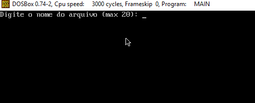

# Trabalho Intel 8086 - ARQ 1 19/1
Trabalho do Intel 8086 da cadeira de ARQ 1 - 19/1 contendo a implementação em ASM do programa solicitado na especificação disponível em **(../Especificacao.pdf)**.

Resumidamente, o programa consiste em exibir na tela o conteúdo de um arquivo de texto digitando periodicamente caractere a caractere, sendo que a periodicidade é definida dentro do próprio arquivo em tags na forma **#xx**, onde **xx** é um número decimal entre **01 e 99** ticks. É possível também que haja uma tag após a outra, por exemplo **#10#15**, o que é tratado normalmente durante a execução.

## Utilização
O programa foi desenvolvido em linguagem Assembly para o montador MASM do DOS rodando em Intel 8086. Para montagem e execução, foi utilizado o simulador [DOSBox](https://www.dosbox.com/) na versão 0.74-2. O executável **MAIN.EXE** em **(../MAIN.EXE)** deve ser colocado no drive virtual do DOSBox e chamado normalmente pela linha de comando.

## Funções Prontas
As funções prontas usadas no programa disponíveis em **(../FuncoesBasicas/*)** foram cedidas pelo professor e desempenham:
- **printf_s**: Escreve o conteúdo de uma string na tela
- **ReadString**: Lê uma string do teclado

## Funções Desenvolvidas
As funções autorais desenvolvidas no programa têm nomes explicativos, mas não custa documentar:
- **printaPergunta**: Pede o nome do arquivo a ser lido e prepara os registradores
- **stringFoiVazia**: Encerra o programa normalmente se o nome inserido for vazio
- **limpaTela**: Limpa a tela de todos os caracteres
- **novaLinha**: Insere uma nova linha no console
- **abreArquivo**: Abre um arquivo na mesma pasta do programa com o nome informado
- **fechaArquivo**: Fecha o arquivo, dado seu handle
- **erroDeAbertura**: Informa que o arquivo não pode ser encontrado
- **getTime**: Gera o número de ticks do processador desde sua inicialização
- **leProxChar**: Lê o próximo caractere do arquivo
- **putChar**: Exibe um caractere na tela
- **getChar**: Lê um caractere do teclado
- **kbHit**: Verifica se alguma tecla foi pressionada (não lê)

## Aviso
Qualquer cópia do código, seja parcial ou total, é expressamente proibida, **exceto nos trechos cedidos pelo professor, que foram analisados em aula**, tendo em vista a anulação do trabalho para todas as partes caso constatado plágio.
